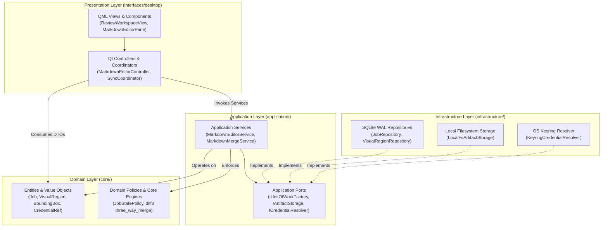

# CONTEXT.md — PolpoT Canonical Domain Glossary & Architectural Seams

This document is the authoritative architectural and domain reference for PolpoT. It defines the system overview, canonical domain vocabulary, layer boundaries, and architectural seams governing all development, refactoring, and AI agent missions.

---

## 1. System Overview

**PolpoT** is a desktop-first, local-first, serverless Document Intelligence & Review Workspace. It automates complex PDF transcription, visual layout analysis, and optical character recognition (OCR) while empowering users with a dual-pane desktop environment for interactive verification, geometry correction, and source editing.

### Key Architectural Pillars

* **Desktop-First & Local-First:** The Qt desktop application (`PySide6`/QML) is the primary product. All state, processing pipelines, historical jobs, and artifact storage reside locally on the user's workstation.
* **Serverless Architecture:** The application operates without remote backend servers, loopback REST APIs (`localhost:8000`), microservices, Docker containers, or web frameworks (`FastAPI`/`uvicorn`). There is zero internal HTTP communication.
* **Local Persistence (SQLite WAL):** Application metadata, job states, settings, and prompt templates are persisted in a local SQLite database configured with Write-Ahead Logging (`PRAGMA journal_mode=WAL;`), enforced foreign keys (`PRAGMA foreign_keys=ON;`), and busy timeouts (`PRAGMA busy_timeout=5000;`).
* **Hardware-Grade Credential Security (OS Keyring):** Sensitive API secrets are never stored in SQLite or plaintext configuration files. Secrets are delegated to the operating system's secure credential vault (Windows Credential Manager, macOS Keychain, Linux Secret Service / KWallet) via the `keyring` library, backed by an encrypted PBKDF2/Fernet fallback vault.
* **Direct Outbound AI Communications:** Document intelligence is powered via direct, client-to-cloud HTTPS requests to configured AI providers (BYOK: Google Gemini, OpenAI, custom endpoints).

---

## 2. Canonical Domain Vocabulary

The following terms define the ubiquitous domain language of PolpoT. These definitions are strictly implemented across `core/`, `application/`, and `interfaces/`.

### 2.1 `Job`
The atomic domain execution unit representing a PDF document processing workflow (`core/entities/job.py`).
* **Lifecycle (`JobStatus`):** Governed by `JobStatePolicy` (`core/policies/job_state_policy.py`). Transitions progress through `PENDING` $\to$ `PROCESSING` $\to$ `DONE` (terminal success). Intermediate or terminal non-success states include `PAUSED` (cooperative pause), `FAILED`, and `CANCELLED`.
* **Pipeline Modes (`JobType`):**
  * *Pipeline 1 (`pipeline1` / standard OCR):* Two-pass execution separating text transcription from visual region detection.
  * *Pipeline 2 (`pipeline2` / unified multimodal layout):* Single-pass layout decomposition combining visual entity localization and semantic text generation.
* **Watermark Tracking (`output_artifact_version_watermark`):** An integer monotonically incremented under atomic SQLite transactions (`BEGIN IMMEDIATE`) to allocate collision-free artifact versions across application restarts and background worker runs.
* **Output Path (`output_path`):** The absolute or managed URI to the currently active canonical Markdown artifact on disk.

### 2.2 `VisualRegion`
A core domain entity representing an extracted visual document element, such as a figure, chart, diagram, table, or schematic (`core/entities/visual_region.py`).
* **Geometry:** Defined by a canonical normalized `BoundingBox` (`core/entities/bounding_box.py`) on an integer grid of `[0, 1000]`, projected to 72 DPI PDF point space `(x, y, width, height)` for rendering and raster cropping.
* **Provenance & Review Status (`ReviewStatus`):** Preserves immutable AI detection provenance (`detected_bbox`) alongside human corrections (`reviewed_bbox`). Statuses include `UNREVIEWED`, `MODIFIED`, `MANUAL`, `REJECTED`, and `ACCEPTED`.
* **Sync Status (`SyncStatus`):** Tracks disk synchronization (`PENDING_INITIAL_CROP`, `SYNCED`, `DIRTY_RECROP_REQUIRED`, `SYNC_FAILED`).
* **Token Identifier:** Unique 32-character UUID4 string (`region_id`) referenced inside the Markdown source via canonical image tokens: ``.

### 2.3 `ReviewWorkspace`
The primary desktop presentation interface (`interfaces/desktop/qml/views/ReviewWorkspaceView.qml`) uniting document inspection and text editing into a synchronized dual-pane workspace:
* **Left Pane (`DocumentViewerView`):** High-performance PDF raster canvas powered by PyMuPDF (`fitz`), hosting interactive bounding box overlays (`BoundingBoxOverlay.qml`) for manual region selection, drag-resizing, and creation.
* **Right Pane (`MarkdownEditorPane` & `MarkdownView`):** Dual-mode workspace providing:
  * `MarkdownEditorPane` (`interfaces/desktop/qml/components/MarkdownEditorPane.qml`): Native CommonMark plain-text source editor with syntax highlighting, search/replace, line navigation, OCC persistence, and an interactive three-way merge conflict resolution toolbar.
  * `MarkdownView` (`interfaces/desktop/qml/views/MarkdownView.qml`): Virtualized, rendered CommonMark AST preview presenting rich typographic styling and embedded image crop previews.

### 2.4 `Canonical Markdown`
The single authoritative, immutable on-disk document artifact (`output_{job_id}_v{version}.md`).
* **Immutability:** Existing versioned markdown files are never overwritten in-place.
* **Monotonic Advancement:** Advanced strictly through `DocumentPublicationService` (via `MarkdownEditorService` or `VisualRegionPublicationService`) using an atomic two-phase commit protocol:
  1. Watermark reservation in SQLite under `BEGIN IMMEDIATE`.
  2. Staged atomic file write to disk.
  3. Pointer update of `jobs.output_path` in SQLite.

### 2.5 `Draft Markdown`
The transient, uncommitted in-memory plain text buffer residing in `MarkdownEditorController`.
* **Dirty Tracking (`isDirty`):** Computed by comparing the active buffer text against the last-loaded or last-saved canonical snapshot.
* **Decoupled Previewing:** Powers live rendered preview generation without mutating disk files or incrementing canonical version numbers.

### 2.6 `OCC (Optimistic Concurrency Control)`
The concurrency control protocol protecting document integrity against race conditions between human interactive edits and asynchronous background pipeline runs.
* **Watermark Verification:** Commits enforce `base_version == active_version`, where `base_version` is the version loaded when editing began, and `active_version` is the current SQLite canonical version.
* **Stale Document Handling:** If `active_version > base_version` during a save attempt, `MarkdownEditorService` raises `StaleDocumentVersionError`, intercepting the save and initiating the three-way merge resolution workflow.

### 2.7 `ConflictSession`
A transient `QObject` presentation model (`interfaces/desktop/models/conflict_session.py`) instantiated when concurrent modifications collide.
* **In-Buffer Conflict Representation:** Embeds Git-style conflict markers (`<<<<<<< LOCAL (Your Edits)`, `=======`, `>>>>>>> REMOTE (Background Update)`) directly into the native editor buffer.
* **Interactive Resolution:** Coordinates the conflict resolution toolbar (`ConflictResolutionBar.qml`), permitting one-click hunk resolution (`Accept Local`, `Accept Remote`, `Accept Both`) or manual text resolution.
* **Save Gating (`canSave`):** Strictly prohibits document saving while unresolved conflicts or malformed markers persist in the editor buffer.

### 2.8 `ConflictHunk`
A discrete difference segment computed during three-way merge analysis (`difflib.SequenceMatcher` diff3 engine in `core/markdown/merge.py` and `application/dto/merge_dto.py`).
* **Hunk Classifications:**
  * `CLEAN_UNCHANGED`: Unmodified across base, local, and remote versions.
  * `CLEAN_LOCAL`: Modified only in local draft; automatically preserved.
  * `CLEAN_REMOTE`: Modified only in canonical remote (e.g. background pipeline recrop or tag update); automatically merged.
  * `CLEAN_SAME`: Identical edits performed both locally and remotely; automatically deduplicated.
  * `CONFLICT`: True overlapping edits requiring human review.
* **AST Context Enrichment:** Hunks are annotated with CommonMark AST metadata (`ast_label`, `ast_node_type`) to indicate the semantic block (e.g. `Header`, `Paragraph`, `List Item`, `Visual Region Token`) affected.

### 2.9 `Preview Synchronization`
The bidirectional navigation and viewport synchronization engine (`ReviewWorkspaceSyncCoordinator` in `interfaces/desktop/coordinators/review_workspace_sync_coordinator.py`).
* **Normalized Proportional Progress:** Tracks scroll offsets as normalized floating-point values (`0.0` to `1.0`), decoupling differences in font size, line wrapping, and image scale.
* **60 FPS Responsiveness:** Synchronizes viewport positions with 16ms throttling and debounced caret updates.
* **Directional Origin Locks:** Employs explicit synchronization origins (`SyncOrigin.SOURCE_USER`, `SyncOrigin.PREVIEW_USER`, `SyncOrigin.IDLE`) to prevent ping-pong recursive feedback loops between editor and preview.
* **Conflict Pausing:** Automatically pauses live preview rendering during active conflict sessions (`previewPaused = true`) to prevent syntax marker disruption.

---

## 3. Architectural Seams Map

PolpoT enforces Clean Architecture and the Dependency Inversion Principle. Dependencies point strictly inward:

```text
Presentation Layer (interfaces/desktop)
         ↓
Application Services (application/services)
         ↓
Application Ports (application/ports)
         ↓
Domain Entities & Policies (core/)
         ↑
Infrastructure Adapters (infrastructure/)
```



### 3.1 Presentation $\to$ Application Services Seam
* **Contract:** Controllers in `interfaces/desktop/controllers/` depend exclusively on application service contracts in `application/services/`.
* **Invariants:**
  * Presentation code is strictly an adapter: it translates UI events into DTOs/commands and binds service outputs to Qt Properties and Signals.
  * Controllers never execute SQL, open file handles directly, or evaluate business policies.

### 3.2 Application Services $\to$ Application Ports Seam
* **Contract:** Application services orchestrate domain entities and interact with external resources strictly through abstract interfaces in `application/ports/` (e.g. `IUnitOfWorkFactory`, `IArtifactStorage`, `ICredentialResolver`, `IPdfEngine`).
* **Invariants:**
  * Application services contain zero imports of `sqlite3`, `keyring`, `fitz`, or vendor SDKs.
  * Services remain 100% unit-testable in isolation using in-memory port test doubles.

### 3.3 Ports $\to$ Infrastructure Adapters Seam
* **Contract:** Concrete adapters in `infrastructure/` implement the ports defined in `application/ports/`.
* **Invariants:**
  * Adapters handle all low-level I/O, SQL compilation, transaction boundaries, and system library calls.
  * Dependency Injection / Composition Root (`interfaces/desktop/composition.py`) wires adapters to services at application startup.

### 3.4 Raw Markdown Text vs Read-Only CommonMark AST Seam
* **Contract:** Raw Markdown plain text (`str`) is the single canonical source of truth for all document content and edits.
* **Invariants:**
  * CommonMark Abstract Syntax Tree parsing (`core/markdown/ast.py` via `markdown-it-py`) is **strictly read-only**.
  * The AST is queried exclusively for viewport rendering, token occurrence extraction, and conflict hunk semantic labelling.
  * **Zero AST-to-Text Serialization:** The AST is **never** serialized back into Markdown text. All document updates and three-way merges operate directly on raw text or line-token streams, guaranteeing absolute format preservation and zero whitespace/markup corruption.

### 3.5 Secret Seam: Domain `CredentialRef` vs Infrastructure OS Keyring
* **Contract:** Domain entities (`Job`, `ApiSlot`, `AppSettings`) and DTOs only ever handle opaque `CredentialRef` references (`core/entities/credential_ref.py`).
* **Invariants:**
  * Plaintext API keys and secrets are **strictly forbidden** in domain entities, SQLite columns, serialized JSON, and debug logs.
  * Secret resolution occurs solely at the infrastructure boundary (`infrastructure/security/keyring_resolver.py`) immediately before an outbound HTTPS request is dispatched to an AI provider.

---

## 4. Legacy Transport Boundary

The Telegram bot implementation is a **frozen legacy transport** maintained strictly for backward compatibility:

* **Contained Surfaces:**
  * `interfaces/telegram/`
  * `handlers/`
  * `main.py`
  * `infrastructure/composition.py` (legacy composition root)
  * Legacy MySQL database adapters and migrations.
* **Architectural Boundary:**
  * The desktop application codebase (`interfaces/desktop/`, `application/services/`, `core/`) has **zero dependencies** on Telegram modules.
  * No Telegram-specific requirements, multi-user concurrency rules, or external MySQL constructs may constrain or influence the desktop architecture.

---

## 5. Platform Support & CI Verification Matrix

PolpoT enforces a strict multi-tier platform architecture ([`AGENTS.md`](AGENTS.md) Rule 28) with differentiated continuous integration and periodic validation gates:

### 5.1 Continuous Integration Matrix (Blocking PR Gates)
* **Tier-1 Linux Reference:** Ubuntu 24.04 LTS x86_64 / Python 3.12 (`test-linux`).
  * *Architecture Boundary:* Ubuntu 24.04 serves as the POSIX reference environment for headless CI, not proof of continuous automated testing across all Linux distributions.
* **Tier-1 Windows Reference:** Windows Server 2025 x64 / Python 3.12 (`windows-2025` runner, `test-windows`).
  * *Architecture Boundary:* Windows CI verifies Win32 OS semantics, file URI pathing (`file:///C:/...`), non-POSIX file locking, and NTFS concurrency. Windows Server CI validates runtime and service correctness, but is not equivalent to consumer Windows 10/11 interactive desktop-shell or display verification. Windows Server 2022 is a non-continuously-tested compatibility target.
* **Security & Quality Gates:** Static whitespace/bytecode/AST quality gates (`quality-gates`) and Gitleaks secret scanning (`secret-scan`) run on every push and pull request.

### 5.2 Periodic & Pre-Release Validation Matrix (Tier-2 Decoupled)
* **macOS Apple Silicon:** macOS 15 ARM64 / Python 3.12 (`macos-15` runner, `test-macos`).
  * *Architecture Boundary:* Native Apple Silicon execution validates Darwin Mach-O wheel loading, Cocoa headless QPA offscreen integration, and APFS case-preservation. Declared application support floor is macOS 12+ (macOS 12 and 13 are Tier-3 best-effort targets), while CI validation explicitly targets `macos-15`.
* **Python Compatibility Matrix:** Python 3.10 and 3.11 on Ubuntu 24.04 reference runner (`test-python-matrix`).
* **Supported Glibc Distributions:** Modern Linux distributions (Fedora 38+, Debian 12+, Arch Linux) are supported by ABI runtime standard, verified via the Linux POSIX reference runner.

### 5.3 Best-Effort (Tier 3) & Unsupported (Tier 4) Boundaries
* **Tier 3 (Best-Effort):** macOS 12 & 13, legacy Intel x86_64 Mac hardware, WSL2, headless Linux without D-Bus (using `EncryptedFileCredentialStore` fallback).
* **Tier 4 (Unsupported):** Musl-based Linux (Alpine), 32-bit operating systems, Windows < 10, macOS < 12, remote cloud/server hosting.
