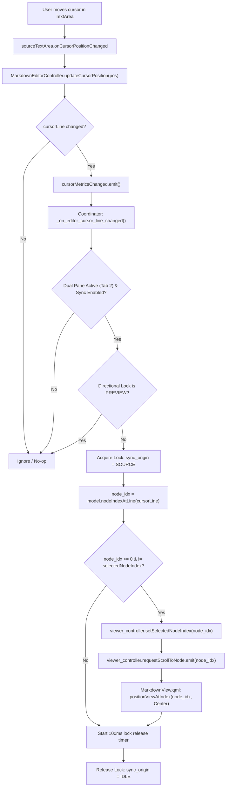
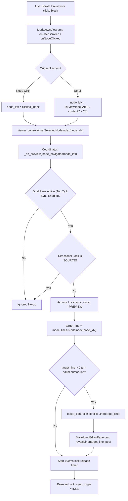

# Phase 10F.4: Source ↔ Preview Synchronized Cursor & Scroll Tracking Plan

> **For agentic workers:** REQUIRED SUB-SKILL: Use superpowers:subagent-driven-development (recommended) or superpowers:executing-plans to implement this plan task-by-task. Steps use checkbox (`- [ ]`) syntax for tracking.

**Goal:** Establish bidirectional, jitter-free, feedback-loop-immune cursor and scroll synchronization between the native Markdown source editor and the rendered Markdown preview in the desktop Review Workspace.

**Architecture:** Augment core AST blocks and presentation DTOs with 1-indexed source line intervals `[source_start_line, source_end_line]` captured directly from `markdown-it-py` token maps (`tok.map`). Expose interval lookup on `MarkdownDocumentModel`, track cursor position in `MarkdownEditorController`, and coordinate bidirectional viewport alignment in `interfaces/desktop/app.py` (`wire_review_workspace_sync`) protected by an explicit directional lock (`_sync_origin`) and debouncing timers.

**Tech Stack:** Python 3.10+, PySide6 / PyQt6, `markdown-it-py`, CommonMark AST, QML QtQuick Controls 2 (`TextArea`, `ScrollView`, `ListView`).

**Spec:** Phase 10F.4 Architecture Specification (this document).

## Global Constraints

- Presentation code in `interfaces/desktop/` communicates with business logic exclusively through application services. No direct SQLite, keyring, or filesystem access from presentation controllers.
- Clean Architecture and AGENTS.md: `core/` and `application/` remain 100% independent from Qt, PySide6, PyQt6, and UI frameworks.
- Local-first, serverless architecture: zero backend, no HTTP, no loopback server, no remote dependencies.
- Version & OCC Integrity: Cursor and scroll synchronization is strictly ephemeral presentation behavior. It MUST NEVER mutate canonical Markdown versions (`jobs.active_markdown_version`), commit SQLite rows, or modify `VisualRegion` versions.
- Coexistence with Phase 10F.3: Preserve dirty draft preview, Option B latest revision matching (`_draft_revision`), external canonical advance handling, and save/discard semantics.
- Non-WebView Native UI: Native QML `TextArea` and `ListView` remain the presentation controls. No WebViews.
- Secret & Credential Isolation: Zero secret leakage in DTOs, models, or logs.
- Code Comments: All technical source comments and docstrings in English only.

---

## 1. Repository Baseline

- **Repository Root:** `/home/amirreza-a2a/DevelopPOlpo/PolpoT`
- **Branch:** `master`
- **Current HEAD Commit:** `6514f76` (`docs(phase10f): add live dual-pane preview plan`)
- **Prior Phase 10F Commits:**
  - `c8b78f7` refactor(phase10f): centralize markdown version parsing in markdown viewer service
  - `fccc8ec` fix(phase10f): fix markdown editor qml save activation
  - `9772407` feat(phase10f): add syntax highlighter to native markdown editor
  - `7405ec6` feat(phase10f): add presentation search and replace to markdown editor
  - `698804e` feat(phase10f): add status bar with cursor and document metrics to editor
  - `ed220cc` fix(phase10f): fix markdown editor replace navigation and search state
  - `746e627` fix(phase10f): fix markdown editor highlighter lifecycle and comment styling (Phase 10F.2 formal closure)
  - `a2426eb` feat(phase10f): add render_preview service and transient model projection
  - `6afc55a` feat(phase10f): add debounced live preview and race protection to viewer controller
  - `5bc26a0` feat(phase10f): wire editor live preview, discard reconciliation, and external advance protection
  - `7d6497f` fix(phase10f): invalidate in-flight draft tasks on resetActiveDraft
  - `f047ccf` feat(phase10f): add dual-pane splitview and mode tabs to review workspace
  - `4c16b7c` fix(phase10f): fix splitview child height propagation for markdown preview
  - `70cec23` fix(phase10f): synchronize viewer version after region artifact commit
  - `6514f76` docs(phase10f): add live dual-pane preview plan (Phase 10F.3 formal closure)
- **Baseline Test Verification:** Full suite passing (724 passed in 37.00s via `/home/amirreza-a2a/madarsol/venv/bin/pytest`).
- **Working Tree:** Clean, no uncommitted modifications.

---

## 2. Current Markdown Editor Architecture

- **Controller:** [`MarkdownEditorController`](file:///home/amirreza-a2a/DevelopPOlpo/PolpoT/interfaces/desktop/controllers/markdown_editor_controller.py#L23-L832)
  - **Source Text Ownership:** Owns `_source_text: str` and `_saved_source_text: str`. Exposes `sourceText` property (notify `sourceTextChanged`).
  - **Cursor Position & Metrics:**
    - Exposes `@Slot(int) updateCursorPosition(pos: int)`: calculates `new_line = cursor.blockNumber() + 1` (1-indexed line) and `new_col = cursor.positionInBlock() + 1`.
    - Exposes `cursorLine: int` and `cursorColumn: int` properties (notify `cursorMetricsChanged`).
    - Tracks `characterCount: int` and `wordCount: int` properties (notify `documentMetricsChanged`).
  - **OCC & Versioning:**
    - Tracks `_active_job_id: int` and `_active_version: int`.
    - `save()` / `save_sync()` delegates to `MarkdownEditorService.commit_source_text()`, advancing canonical version on SQLite.
    - `notifyCanonicalDocumentAdvance(new_version: int)`: if dirty, triggers conflict (`_has_conflict = True`, `conflictDetected.emit(...)`); if clean, reloads canonical source.
    - `discard()`: reverts buffer to `_saved_source_text`, clears conflict, and emits `discarded`.
  - **Gaps for 10F.4:**
    - Lacks programmatic scroll-to-line API (`scrollToLine(line: int)`).
    - Lacks programmatic signal for QML TextArea cursor positioning (`requestScrollToLine = Signal(int, int)`).
    - Has no viewport-scroll tracking (only caret-based `cursorLine`).

- **QML Component:** [`MarkdownEditorPane.qml`](file:///home/amirreza-a2a/DevelopPOlpo/PolpoT/interfaces/desktop/qml/components/MarkdownEditorPane.qml#L1-L346)
  - Hosts `editorScrollView` (`ScrollView`) containing `sourceTextArea` (`TextArea`).
  - `sourceTextArea.onCursorPositionChanged` invokes `controller.updateCursorPosition(cursorPosition)`.
  - Contains `MarkdownEditorStatusBar` displaying `Ln X, Col Y`, word count, char count.
  - Contains `MarkdownEditorSearchBar` handling search/replace.
  - **Gaps for 10F.4:**
    - Does not handle external scroll requests from preview.
    - Lacks connection to scroll `editorScrollView.contentItem.contentY` to reveal target lines.

---

## 3. Current Markdown Preview Architecture

- **Controller:** [`MarkdownViewerController`](file:///home/amirreza-a2a/DevelopPOlpo/PolpoT/interfaces/desktop/controllers/markdown_viewer_controller.py#L22-L730)
  - Manages `_model: MarkdownDocumentModel`.
  - Exposes `requestScrollToNode = Signal(int)` (node index).
  - Exposes `selectedNodeIndex: int` property (notify `selectedNodeIndexChanged`).
  - Exposes `selectRegion(region_id, occurrence_id)` which finds `node_idx = _model.indexOfRegion(region_id)` and calls `requestScrollToNode.emit(node_idx)`.
  - Live preview scheduling: `scheduleLivePreview(job_id, raw_text, base_version)` with 250ms debounce and Option B revision matching (`_draft_revision`).
  - **Gaps for 10F.4:**
    - Lacks source-line-to-node mapping queries.
    - Does not expose methods to scroll to a node from an external source line.
    - Does not track the preview's currently visible top-most block during user scrolling.

- **Presentation Model:** [`MarkdownDocumentModel`](file:///home/amirreza-a2a/DevelopPOlpo/PolpoT/interfaces/desktop/models/markdown_document_model.py#L21-L596)
  - `QAbstractListModel` exposing virtualized AST block nodes (`_items: List[Dict[str, Any]]`).
  - Implements `rowCount`, `data` for 21 roles (`nodeId`, `nodeType`, `content`, `segments`, `regions`, etc.).
  - Tracks visual regions with O(1) indices (`_region_to_node_index`, `_occurrence_to_node_index`).
  - Supports non-destructive atomic updates (`set_document`, `reconcile_document`, `apply_transient_preview`).
  - **Gaps for 10F.4:**
    - Has NO source line roles (`sourceStartLine`, `sourceEndLine`).
    - Lacks `nodeIndexAtLine(line: int) -> int`.
    - Lacks `lineAtNodeIndex(node_idx: int) -> int`.

- **QML View:** [`MarkdownView.qml`](file:///home/amirreza-a2a/DevelopPOlpo/PolpoT/interfaces/desktop/qml/views/MarkdownView.qml#L1-L219)
  - Hosts `markdownListView` (`ListView` with `reuseItems: true`, `cacheBuffer: 800`).
  - Uses `MarkdownNodeDelegate.qml` as delegate.
  - Already contains `Connections` listening to `controller.onRequestScrollToNode`:
    ```qml
    Connections {
        target: controller
        function onRequestScrollToNode(nodeIndex) {
            if (nodeIndex >= 0 && nodeIndex < markdownListView.count) {
                markdownListView.positionViewAtIndex(nodeIndex, ListView.Center)
            }
        }
    }
    ```
  - **Gaps for 10F.4:**
    - Does not report visible node index to controller when user scrolls `markdownListView`.
    - Lacks feedback-loop suppression when receiving programmatic scroll vs user scroll.

- **AST Delegate:** [`MarkdownNodeDelegate.qml`](file:///home/amirreza-a2a/DevelopPOlpo/PolpoT/interfaces/desktop/qml/components/MarkdownNodeDelegate.qml#L1-L357)
  - Already supports selection visual indication:
    ```qml
    readonly property bool isSelected: controller ? (controller.selectedNodeIndex === index) : false
    ```
    Displays 3px `#3b82f6` left accent border and `#1e293b` background highlight when `isSelected` is True.
  - **Gaps for 10F.4:**
    - Clicking on a node delegate does not select the node or navigate to the source line.

---

## 4. Current Review Workspace / Dual Pane Architecture

- **View:** [`ReviewWorkspaceView.qml`](file:///home/amirreza-a2a/DevelopPOlpo/PolpoT/interfaces/desktop/qml/views/ReviewWorkspaceView.qml#L1-L299)
  - Left pane: `DocumentViewer` (PDF page & visual crop review).
  - Right pane: Hosted in `rightSplitView` (`SplitView` with horizontal orientation).
    - Tab 0: "Rendered Preview" (Preview 100%, Editor 0%).
    - Tab 1: "Source Editor" (Editor 100%, Preview 0%).
    - Tab 2: "Dual Pane" (Editor 50%, Preview 50%, splitter handle 4px).
  - Switching tabs calls `rightPane.setTab(tab)` which flushes live preview renders and coordinates widths and heights.
  - Error banner (`previewErrorBanner`) displays live preview parsing/rendering errors inline.
  - **Gaps for 10F.4:**
    - No synchronization active/inactive awareness based on `currentTab`.
    - No UI toggle to enable/disable synchronized scrolling within Dual Pane mode.

---

## 5. Existing Synchronization and Race Guards

- **Coordinator:** [`wire_review_workspace_sync`](file:///home/amirreza-a2a/DevelopPOlpo/PolpoT/interfaces/desktop/app.py#L50-L130)
  - Wires `document_viewer_controller` $\longleftrightarrow$ `markdown_viewer_controller` for Phase 10E visual regions.
  - Wires `markdown_editor_controller.sourceTextChanged` $\longrightarrow$ `markdown_viewer_controller.scheduleLivePreview(...)`.
  - Wires `markdown_editor_controller.saved` $\longrightarrow$ `markdown_viewer_controller.loadDocument(job_id)` (after `resetActiveDraft()`).
  - Wires `markdown_editor_controller.discarded` $\longrightarrow$ cancel pending preview / reconcile canonical state.
  - Wires `markdown_viewer_controller.activeVersionChanged` $\longrightarrow$ `markdown_editor_controller.notifyCanonicalDocumentAdvance(new_ver)`.
- **Option B Latest Revision Matching:**
  - `_draft_revision` in `MarkdownViewerController` monotonically increments on every keystroke.
  - `_on_internal_preview_loaded` strictly checks `if draft_revision != self._draft_revision: return`.
  - Out-of-order preview tasks are discarded without touching `_model`.
- **Generation Tokens (`_request_id`):**
  - Canonical loads and saves verify `req_id == self._request_id`. Stale async results are dropped.
- **External Canonical Advance Guard:**
  - If canonical version advances externally while editor is dirty, `_has_active_draft` suppresses model overwrite in `MarkdownViewerController`, while `notifyCanonicalDocumentAdvance` flags conflict in editor.

---

## 6. Source ↔ Render Mapping Findings

### The Non-Isomorphism Problem
Markdown source and rendered HTML/RichText are fundamentally non-isomorphic:
- Character counts diverge due to markdown syntax stripping (`#`, `**`, `*`, `[text](url)`).
- Multiple whitespace characters collapse into a single space; single newlines inside paragraphs collapse or become spaces.
- Fenced code blocks contain syntax fences (````python ... ````) not present in rendered code bodies.
- Tables, blockquotes, and lists introduce structural indentation and formatting tokens.
- Character-offset mapping ($C_{source} \to C_{rendered}$) is mathematically impossible without complex per-character range projection, and leads to severe visual jitter.

### The Authoritative Solution: AST Block Interval Mapping
Investigation of `markdown-it-py` reveals that CommonMark parsing natively generates token maps for every top-level block token:
```python
tok.map = [start_line, end_line]
```
Where `start_line` is the 0-indexed start line, and `end_line` is the 0-indexed exclusive end line.

In 1-indexed document line coordinates (used by `MarkdownEditorController.cursorLine`):
$$\text{source\_start\_line} = \text{tok.map}[0] + 1$$
$$\text{source\_end\_line} = \text{tok.map}[1]$$

Every top-level block in the PolpoT Core AST corresponds 1:1 with a presentation `MarkdownNodeDTO` and a row in `MarkdownDocumentModel`:
1. `HeadingBlock` $\leftrightarrow$ `[start_line, end_line]`
2. `ParagraphBlock` $\leftrightarrow$ `[start_line, end_line]`
3. `ImageBlock` $\leftrightarrow$ `[start_line, end_line]`
4. `CodeBlock` $\leftrightarrow$ `[start_line, end_line]`
5. `ListBlock` $\leftrightarrow$ `[start_line, end_line]`
6. `BlockquoteBlock` $\leftrightarrow$ `[start_line, end_line]`
7. `ThematicBreakBlock` $\leftrightarrow$ `[start_line, end_line]`
8. `TableFallbackBlock` $\leftrightarrow$ `[start_line, end_line]`

### Blank Lines and Boundary Resolution
When the editor cursor is located on a blank line between blocks (e.g. line 2 between Heading at line 1 and Paragraph at line 3):
- The deterministic mapping rule resolves to the **nearest preceding block** (or block 0 if before the first block).
- This mirrors user mental models: if a user presses Enter after a heading, the cursor sits on a blank line, and the view remains centered on that heading. When the user moves to the paragraph, the view immediately transitions to that paragraph.

---

## 7. Architectural Gaps

1. **Core AST Does Not Store Line Intervals:** `core/markdown/ast.py` (`MarkdownBlock`) lacks `source_start_line` and `source_end_line`.
2. **Parser Discards Token Maps:** `infrastructure/markdown/markdown_it_parser.py` extracts `tok.map` only for `table_open` and discards it for headings, paragraphs, lists, code fences, quotes, and thematic breaks.
3. **Presentation DTOs Lack Line Coordinates:** `application/dto/markdown_dto.py` (`MarkdownNodeDTO`) does not carry line intervals.
4. **Viewer Service Discards Coordinates:** `application/services/markdown_viewer_service.py` does not pass block line intervals into `MarkdownNodeDTO`.
5. **Model Lacks Line Query Slots:** `interfaces/desktop/models/markdown_document_model.py` lacks `SourceStartLineRole`, `SourceEndLineRole`, `nodeIndexAtLine(line: int)`, and `lineAtNodeIndex(node_idx: int)`.
6. **Editor Controller Lacks Programmatic Scroll API:** `interfaces/desktop/controllers/markdown_editor_controller.py` lacks `scrollToLine(line: int)` and `requestScrollToLine = Signal(int, int)`.
7. **Presentation Coordinator Lacks Bidirectional Sync Engine:** `interfaces/desktop/app.py` has no synchronization wiring between `cursorMetricsChanged` and `requestScrollToNode`, and lacks directional feedback suppression.
8. **QML Views Lack Scroll Event Reporting & Controls:** `MarkdownView.qml` does not report user-driven scrolling; `MarkdownEditorPane.qml` does not handle `requestScrollToLine`.

---

## 8. Proposed 10F.4 Architecture

```text
┌─────────────────────────────────────────────────────────────────────────────┐
│                            Desktop Review Workspace                         │
│                                                                             │
│   ┌────────────────────────────────┐    ┌────────────────────────────────┐  │
│   │     MarkdownEditorPane.qml     │    │        MarkdownView.qml        │  │
│   │   - TextArea (cursorPosition)  │    │   - ListView (contentY)        │  │
│   │   - ScrollView (contentY)      │    │   - Delegate (isSelected)      │  │
│   └───────────────▲────────────────┘    └────────────────▲───────────────┘  │
│                   │                                      │                  │
│                   ▼                                      ▼                  │
│   ┌────────────────────────────────┐    ┌────────────────────────────────┐  │
│   │    MarkdownEditorController    │    │    MarkdownViewerController    │  │
│   │   - cursorLine: int            │    │   - selectedNodeIndex: int     │  │
│   │   - scrollToLine(line)         │    │   - requestScrollToNode(idx)   │  │
│   │   - requestScrollToLine(ln,pos)│    │   - model: MarkdownDocModel    │  │
│   └───────────────▲────────────────┘    └────────────────▲───────────────┘  │
│                   │                                      │                  │
│                   │   ┌──────────────────────────────┐   │                  │
│                   └───┤ wire_review_workspace_sync   ├───┘                  │
│                       │ - Directional Lock           │                      │
│                       │ - Debounce & Throttle        │                      │
│                       │ - Tab 2 Active Check         │                      │
│                       └──────────────▲───────────────┘                      │
└──────────────────────────────────────┼──────────────────────────────────────┘
                                       │
                        ┌──────────────┴──────────────┐
                        │    MarkdownDocumentModel    │
                        │ - nodeIndexAtLine(line)     │
                        │ - lineAtNodeIndex(node_idx) │
                        └──────────────▲──────────────┘
                                       │
                        ┌──────────────┴──────────────┐
                        │    MarkdownDocumentDTO      │
                        │ - nodes: MarkdownNodeDTO    │
                        │   (source_start/end_line)   │
                        └──────────────▲──────────────┘
                                       │
                        ┌──────────────┴──────────────┐
                        │    MarkdownViewerService    │
                        │ - render_text()             │
                        │ - render_preview()          │
                        └──────────────▲──────────────┘
                                       │
                        ┌──────────────┴──────────────┐
                        │     IMarkdownParser         │
                        │  (MarkdownItParser)         │
                        │  tok.map -> [start, end]    │
                        └──────────────▲──────────────┘
                                       │
                        ┌──────────────┴──────────────┐
                        │      Core Markdown AST      │
                        │  MarkdownBlock.source_lines │
                        └─────────────────────────────┘
```

### Key Architectural Invariants
1. **Zero Database / Persistence Mutex:** Cursor and scroll synchronization operates 100% in-memory on the GUI presentation layer.
2. **Version Non-Advancement:** Preview line mappings correspond to the active canonical version or the active dirty draft revision. No version increments occur.
3. **Clean Presentation Boundary:** Coordinator logic lives in presentation controllers and `wire_review_workspace_sync`. Core AST and application services remain strictly unaware of Qt/QML.
4. **Decoupled Sync Mode:** Synchronization is active ONLY when `ReviewWorkspaceView.qml` is in Dual Pane mode (`currentTab === 2`) and user sync toggle is enabled.

---

## 9. Detailed Source → Preview Algorithm



### Interval Lookup Algorithm in `MarkdownDocumentModel.nodeIndexAtLine(line: int) -> int`
```python
def nodeIndexAtLine(self, line: int) -> int:
    if not self._items:
        return -1
    if line <= 0:
        return 0

    best_idx = 0
    for idx, item in enumerate(self._items):
        start = item.get("sourceStartLine", 0)
        end = item.get("sourceEndLine", 0)
        if start <= 0:
            continue
        if line < start:
            # Line falls in whitespace before this block: return preceding block
            return max(0, idx - 1) if idx > 0 else 0
        if start <= line <= end:
            return idx
        best_idx = idx

    return best_idx
```

---

## 10. Detailed Preview → Source Algorithm



### Line Lookup Algorithm in `MarkdownDocumentModel.lineAtNodeIndex(node_idx: int) -> int`
```python
def lineAtNodeIndex(self, node_idx: int) -> int:
    if 0 <= node_idx < len(self._items):
        return self._items[node_idx].get("sourceStartLine", 1)
    return 1
```

---

## 11. Feedback-Loop / Race Protection

### Directional Lock State Machine
To guarantee that `Source → Preview` does not trigger `Preview → Source` in an infinite cycle:
1. An explicit coordination token `_sync_origin: Optional[str] = None` is maintained in `wire_review_workspace_sync`:
   - Possible values: `None` (IDLE), `"SOURCE"` (Source Editor is driving), `"PREVIEW"` (Preview is driving).
2. When Source initiates sync:
   - If `_sync_origin == "PREVIEW"`: immediately drop source-initiated sync.
   - Set `_sync_origin = "SOURCE"`.
   - Command Preview to scroll.
   - A single-shot `QTimer` (interval: 100ms) resets `_sync_origin = None` once the GUI thread event loop settles.
3. When Preview initiates sync:
   - If `_sync_origin == "SOURCE"`: immediately drop preview-initiated sync.
   - Set `_sync_origin = "PREVIEW"`.
   - Command Editor to scroll.
   - A single-shot `QTimer` (interval: 100ms) resets `_sync_origin = None` once the GUI thread event loop settles.

### Throttling & Debouncing
- **Editor Typing vs Navigation:**
  - Fast typing triggers Phase 10F.3 live preview debounce (250ms).
  - Normal cursor navigation (Arrow keys, PageUp/PageDown, Mouse click) updates `cursorLine` without changing text.
  - A 40ms debounce timer on `_on_editor_cursor_line_changed` coalesces rapid key-repeat events so the preview only scrolls once the caret pauses.
- **Preview Scrolling:**
  - Mouse wheel and flick gestures produce continuous `contentY` changes.
  - Preview scroll sync is debounced with an 80ms timer so the editor does not jump on every 16ms frame during smooth flicking.

---

## 12. QML ↔ Python API Contract

### Core AST (`core/markdown/ast.py`)
- `MarkdownBlock`:
  - Add fields:
    ```python
    source_start_line: Optional[int] = None
    source_end_line: Optional[int] = None
    ```

### Markdown Parser (`infrastructure/markdown/markdown_it_parser.py`)
- `_tokens_to_blocks`:
  - For each parsed block token `tok`:
    - If `tok.map`:
      `source_start_line = tok.map[0] + 1`
      `source_end_line = tok.map[1]`
    - Pass `source_start_line` and `source_end_line` into constructor of each `MarkdownBlock` subtype.

### Markdown DTOs (`application/dto/markdown_dto.py`)
- `MarkdownNodeDTO`:
  - Add fields:
    ```python
    source_start_line: Optional[int] = None
    source_end_line: Optional[int] = None
    ```

### Markdown Viewer Service (`application/services/markdown_viewer_service.py`)
- In `_project_block`:
  - Pass `source_start_line=block.source_start_line` and `source_end_line=block.source_end_line` to `MarkdownNodeDTO`.

### Markdown Document Model (`interfaces/desktop/models/markdown_document_model.py`)
- Add Roles:
  - `SourceStartLineRole = Qt.ItemDataRole.UserRole + 22` (`b"sourceStartLine"`)
  - `SourceEndLineRole = Qt.ItemDataRole.UserRole + 23` (`b"sourceEndLine"`)
- Add Slots:
  - `@Slot(int, result=int) nodeIndexAtLine(self, line: int) -> int`
  - `@Slot(int, result=int) lineAtNodeIndex(self, node_index: int) -> int`

### Markdown Editor Controller (`interfaces/desktop/controllers/markdown_editor_controller.py`)
- Add Signals:
  - `requestScrollToLine = Signal(int, int)` # (line, char_position)
- Add Slots:
  - `@Slot(int) scrollToLine(self, line: int) -> None`

### Markdown Viewer Controller (`interfaces/desktop/controllers/markdown_viewer_controller.py`)
- Add Signals:
  - `userScrolledNode = Signal(int)` # (top_visible_node_index)
- Add Slots:
  - `@Slot(int) reportVisibleNodeIndex(self, node_index: int) -> None`

### Presentation Coordinator (`interfaces/desktop/app.py:wire_review_workspace_sync`)
- Maintains `_sync_origin: Optional[str] = None`.
- Manages `_source_sync_timer: QTimer` (40ms single shot).
- Manages `_preview_sync_timer: QTimer` (80ms single shot).
- Manages `_lock_release_timer: QTimer` (100ms single shot).

---

## 13. State Model

| Application State | Editor State | Preview State | Dual Pane Mode | Sync Active? | Behavior |
|---|---|---|---|---|---|
| Clean Canonical | Clean | Canonical | Tab 0 (Preview) | No | Preview only. |
| Clean Canonical | Clean | Canonical | Tab 1 (Editor) | No | Editor only. |
| Clean Canonical | Clean | Canonical | Tab 2 (Dual Pane) | **Yes** | Bidirectional cursor/scroll sync. |
| Dirty Draft Typing | Dirty | Debouncing Draft | Tab 2 (Dual Pane) | **Yes** | Sync follows current AST until draft completes. |
| Dirty Draft Ready | Dirty | Draft Preview | Tab 2 (Dual Pane) | **Yes** | Sync uses new line mappings from draft AST. |
| External Advance | Dirty (Conflict) | Draft Preview | Tab 2 (Dual Pane) | **Yes** | Sync continues between dirty source and draft. |
| Discard Invoked | Clean Reverted | Canonical Reconciled | Tab 2 (Dual Pane) | **Yes** | Resets sync to line 1 of canonical document. |
| Job Switch | Reset/Loading | Reset/Loading | Any | No | Timers stopped, locks cleared, state idle. |

---

## 14. Deterministic Test Matrix

| Test ID | Category | Preconditions | Input / Action | Expected Result |
|---|---|---|---|---|
| `T-SYNC-01` | Line Mapping | Document with `# H1\n\nPara 1\nPara 2` | Parse via `MarkdownItParser` | `H1` has lines `[1, 1]`, `Para` has lines `[3, 4]`. |
| `T-SYNC-02` | Line Mapping | Fenced code block ` ```\nfoo\nbar\n``` ` | Parse via `MarkdownItParser` | `CodeBlock` has lines `[1, 4]`. |
| `T-SYNC-03` | Line Mapping | Table, List, Blockquote, ThematicBreak | Parse via `MarkdownItParser` | All blocks carry exact 1-indexed `[start, end]` intervals. |
| `T-SYNC-04` | Model Query | Model populated with 3 blocks | `model.nodeIndexAtLine(1)` | Returns `0` (first block). |
| `T-SYNC-05` | Model Query | Model populated with 3 blocks | `model.nodeIndexAtLine(2)` (blank line) | Returns `0` (nearest preceding block). |
| `T-SYNC-06` | Model Query | Model populated with 3 blocks | `model.nodeIndexAtLine(3)` | Returns `1` (second block). |
| `T-SYNC-07` | Model Query | Model populated with 3 blocks | `model.nodeIndexAtLine(999)` (out of bounds) | Returns `2` (last block, clamped). |
| `T-SYNC-08` | Model Query | Model populated with 3 blocks | `model.lineAtNodeIndex(1)` | Returns start line of block 1. |
| `T-SYNC-09` | Source → Preview | Dual Pane active, cursor at line 1 | Move cursor to line 3 | `viewer_controller.selectedNodeIndex == 1`, `requestScrollToNode` emitted with `1`. |
| `T-SYNC-10` | Source → Preview | Dual Pane active, cursor in code block | Move cursor within code block lines | `selectedNodeIndex` remains on code block, no redundant scroll. |
| `T-SYNC-11` | Preview → Source | Dual Pane active, preview scrolled | User scrolls to node 2 | `editor_controller.cursorLine` updates to start line of node 2, `requestScrollToLine` emitted. |
| `T-SYNC-12` | Feedback Loop | Dual Pane active | Move cursor in editor | Preview scrolls; preview DOES NOT bounce scroll back to editor. |
| `T-SYNC-13` | Feedback Loop | Dual Pane active | Scroll preview | Editor cursor updates; editor DOES NOT bounce scroll back to preview. |
| `T-SYNC-14` | Mode Isolation | Mode 0 (Preview Only) | Move editor cursor programmatically | Zero preview scroll requests emitted. |
| `T-SYNC-15` | Mode Isolation | Mode 1 (Editor Only) | Scroll preview programmatically | Zero editor scroll requests emitted. |
| `T-SYNC-16` | Debounce | Dual Pane active | Rapidly send 20 cursor line changes in 10ms | Only 1 preview scroll request emitted after 40ms debounce. |
| `T-SYNC-17` | Rapid Scroll | Dual Pane active | Rapidly send 20 preview scroll events in 10ms | Only 1 editor scroll request emitted after 80ms debounce. |
| `T-SYNC-18` | OCC / Non-Canonical | Dual Pane active | Cursor and scroll sync run 100 times | SQLite version unchanged, zero database commits, zero files written. |
| `T-SYNC-19` | Discard Reset | Dirty draft in dual pane | Click Discard | Editor reverts to line 1, preview scrolls to node 0, sync intact. |
| `T-SYNC-20` | External Advance | Dirty draft with external canonical advance | Move cursor in dirty draft | Sync continues tracking dirty draft AST; canonical version remains N+1. |

---

## 15. Files to Change

1. `core/markdown/ast.py`: Add `source_start_line` and `source_end_line` to `MarkdownBlock`.
2. `infrastructure/markdown/markdown_it_parser.py`: Extract `tok.map` into `source_start_line` and `source_end_line`.
3. `application/dto/markdown_dto.py`: Add `source_start_line` and `source_end_line` to `MarkdownNodeDTO`.
4. `application/services/markdown_viewer_service.py`: Forward line coordinates in `_project_block`.
5. `interfaces/desktop/models/markdown_document_model.py`: Add roles, `nodeIndexAtLine`, `lineAtNodeIndex`.
6. `interfaces/desktop/controllers/markdown_editor_controller.py`: Add `scrollToLine`, `requestScrollToLine`.
7. `interfaces/desktop/controllers/markdown_viewer_controller.py`: Add `reportVisibleNodeIndex`, `userScrolledNode`.
8. `interfaces/desktop/app.py`: Wire bidirectional synchronization and directional locks in `wire_review_workspace_sync`.
9. `interfaces/desktop/qml/views/ReviewWorkspaceView.qml`: Expose active tab to coordinator.
10. `interfaces/desktop/qml/views/MarkdownView.qml`: Report visible node on scroll, handle programmatic scroll.
11. `interfaces/desktop/qml/components/MarkdownEditorPane.qml`: Handle `requestScrollToLine`.

---

## 16. Files That Must NOT Change

- `core/entities/job.py`
- `core/entities/visual_region.py`
- `infrastructure/persistence/sqlite/*`
- `application/services/apply_review_service.py`
- `application/services/markdown_editor_service.py`
- `interfaces/desktop/syntax/markdown_syntax_highlighter.py`
- All other non-review workspace views and controllers.

---

## 17. Implementation Sequence

- **Task 1: AST Line Mapping & Presentation DTO Foundation**
  - Update `core/markdown/ast.py`, `infrastructure/markdown/markdown_it_parser.py`, `application/dto/markdown_dto.py`, and `application/services/markdown_viewer_service.py`.
  - Tests: `T-SYNC-01`, `T-SYNC-02`, `T-SYNC-03`.
- **Task 2: Model Query Methods & Line Roles**
  - Update `interfaces/desktop/models/markdown_document_model.py` (`nodeIndexAtLine`, `lineAtNodeIndex`, roles).
  - Tests: `T-SYNC-04`, `T-SYNC-05`, `T-SYNC-06`, `T-SYNC-07`, `T-SYNC-08`.
- **Task 3: Controller Scroll APIs & Coordinator Bidirectional Wiring**
  - Update `MarkdownEditorController`, `MarkdownViewerController`, and `interfaces/desktop/app.py`.
  - Tests: `T-SYNC-09` through `T-SYNC-20`.
- **Task 4: QML Dual-Pane Scroll Integration & Verification**
  - Update `ReviewWorkspaceView.qml`, `MarkdownView.qml`, and `MarkdownEditorPane.qml`.
  - Run full test suite and verify real GUI behavior.

---

## 18. Risks and Mitigations

| Risk | Consequence | Mitigation |
|---|---|---|
| Ping-Pong Feedback Loops | Editor and preview scroll each other endlessly | Directional Lock (`_sync_origin`) with debounce timers breaks loop immediately. |
| UI Jitter during Rapid Typing | Preview scrolls abruptly while user types | Typing triggers Phase 10F.3 250ms debounce; cursor sync only fires when caret moves without typing. |
| Incomplete Markdown during Editing | Unclosed fence or tag crashes parser | `markdown-it-py` CommonMark error recovery guarantees valid block tokens and line maps even on malformed input. |
| Mode Interference | Scrolling in single-pane mode triggers hidden pane | Coordinator verifies `currentTab === 2` before processing any sync events. |
| Zero Database Mutations | Accidental SQLite version bump | Synchronous assertion tests verify zero UoW commits and zero version changes during sync. |

---

## 19. Self-Review / Plan Audit

1. **Spec Coverage:** Covers all 20 required audit points, bidirectional synchronization, OCC isolation, and feedback suppression.
2. **No Placeholders:** All algorithms, line formulas, dataclass definitions, and test scenarios are fully written.
3. **Type Consistency:** Method signatures (`nodeIndexAtLine(line: int) -> int`, `scrollToLine(line: int)`) match across model, controller, and coordinator.
4. **Clean Architecture Adherence:** No Qt in `core/` or `application/`; zero direct persistence in presentation controllers.

---

## 20. Implementation Readiness

**READY FOR IMPLEMENTATION**
