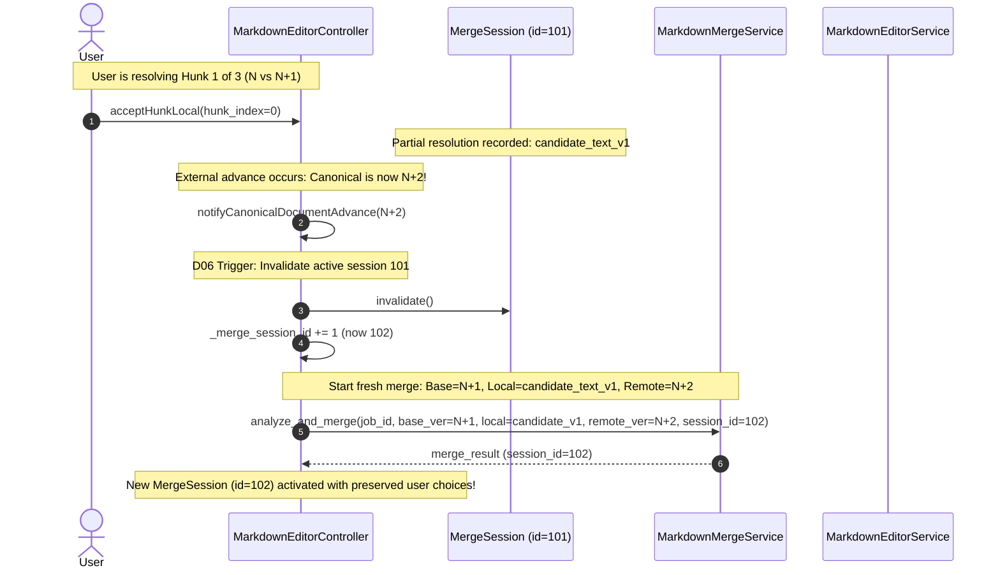
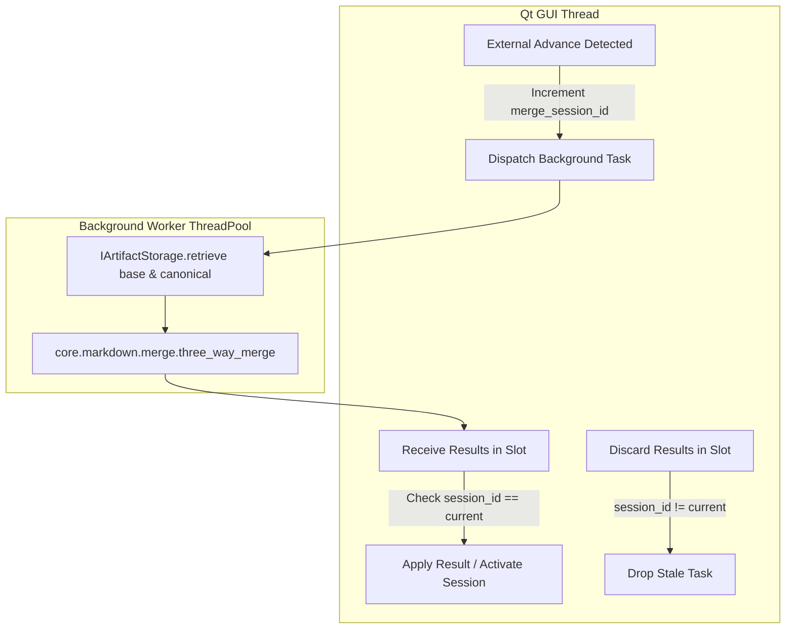
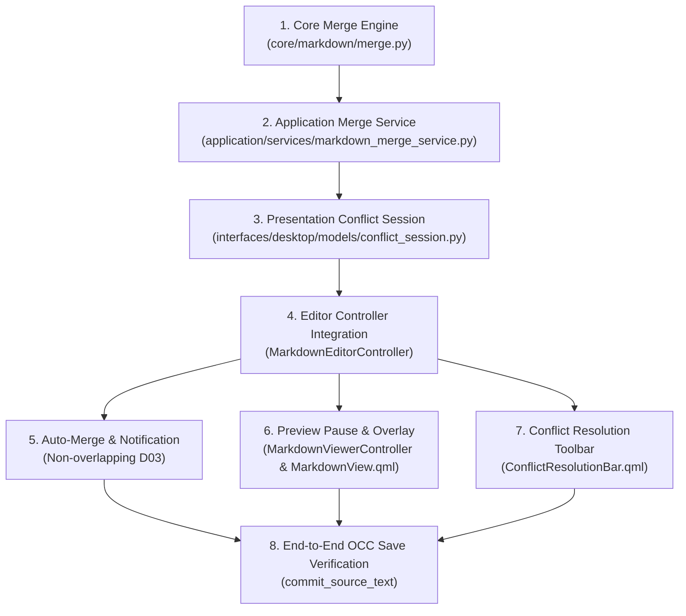

# Phase 10F.5 Codebase Design: Three-Way Merge & Visual Conflict Diff Resolution

- **Phase:** 10F.5 — Three-Way Merge / Visual Conflict Diff Resolution
- **Repository:** `~/DevelopPOlpo/PolpoT`
- **Baseline Commit:** `9a242f4` (Phase 10F.5 ADR recorded)
- **Status:** **ARCHITECTURE READY FOR PLANNING**

---

## 1. Architecture Decision Summary

All architectural and product decisions established in [`docs/adr/2026-09-18-adr-001-phase10f5-three-way-merge-conflict-resolution.md`](file:///home/amirreza-a2a/DevelopPOlpo/PolpoT/docs/adr/2026-09-18-adr-001-phase10f5-three-way-merge-conflict-resolution.md) are authoritative:

| Decision ID | Subject | Settled Choice | Design Constraint |
| :--- | :--- | :--- | :--- |
| **D01** | **Persistence Scope** | Session-Only | Uncommitted drafts and merge sessions exist only in RAM. No SQLite schema changes or draft migrations in 10F.5. |
| **D02** | **Merge Engine** | Hybrid Text diff3 + AST Context | Deterministic line-based `diff3` over raw text. Markdown AST is read-only for hunk labeling. Zero AST-to-text de-parsing. |
| **D03** | **Non-Overlapping Merge** | Automatic with Notification | Disjoint line edits merge automatically into editor buffer; base advances to $N+1$; toast banner informs user. |
| **D04** | **Conflict Resolution UX** | In-Buffer Markers + Toolbar | Native `MarkdownEditorPane` hosts transient `<<<<<<<` markers; interactive toolbar drives resolution; save strictly gated. |
| **D05** | **Preview During Conflict** | Suspended with Overlay | Normal preview paused; displays last valid render + `⚠️ Preview paused during conflict resolution` overlay banner. |
| **D06** | **Second External Advance** | Invalidate & Re-Merge | If canonical advances $N+1 \to N+2$ mid-resolution, session aborts; in-progress work becomes Local input for fresh merge. |
| **D07** | **Job Switching** | Blocked with Confirmation | Switching jobs while dirty or in conflict prompts user to confirm discarding uncommitted edits. |
| **D08** | **Session Identity** | Dedicated `merge_session_id` | Monotonic integer token isolates merge lifecycle and discards stale asynchronous diff computations. |

---

## 2. Existing Architecture Extension Points

The design attaches cleanly to existing system seams without modifying established contracts:

```text
[ DocumentViewerController ] (PDF Viewer)
          │
          │ regionArtifactCommitted(job_id, region_id, vN+1, uri)
          ▼
[ MarkdownViewerController ] (Preview Controller)
          │
          │ _sync_document_structure() loads canonical vN+1
          │ activeVersionChanged(vN+1)
          ▼
[ interfaces/desktop/app.py: wire_review_workspace_sync ]
          │
          │ _on_viewer_version_changed()
          ▼
[ MarkdownEditorController.notifyCanonicalDocumentAdvance(vN+1) ]
          │
          ├──> If isDirty == False: loads vN+1 directly (clean reload)
          │
          └──> If isDirty == True: [NEW SEAM: Phase 10F.5 Trigger]
                     │
                     ▼
       MarkdownMergeService.analyze_and_merge(...)
                     │
                     ├──> [Clean Merge]: Auto-applies to editor, emits notification
                     │
                     └──> [Conflicting Merge]: Initializes MergeSession,
                          injects markers, suspends preview, activates toolbar
```

### Key Reused Seams
1. **[`MarkdownEditorService.commit_source_text`](file:///home/amirreza-a2a/DevelopPOlpo/PolpoT/application/services/markdown_editor_service.py#L63):** Reused unmodified for committing resolved Markdown under standard OCC with `base_version = canonical_version`.
2. **[`IArtifactStorage.retrieve`](file:///home/amirreza-a2a/DevelopPOlpo/PolpoT/infrastructure/storage/local_storage.py#L76):** Retrieves immutable `output_{job}_v{base}.md` and `output_{job}_v{canonical}.md`.
3. **[`MarkdownDocumentModel`](file:///home/amirreza-a2a/DevelopPOlpo/PolpoT/interfaces/desktop/models/markdown_document_model.py#L22):** Provides read-only `nodeIndexAtLine` and `sourceStartLine`/`sourceEndLine` intervals for AST context enrichment.
4. **[`ReviewWorkspaceSyncCoordinator`](file:///home/amirreza-a2a/DevelopPOlpo/PolpoT/interfaces/desktop/coordinators/review_workspace_sync_coordinator.py#L21):** Synchronized scroll tracking pauses while preview is suspended, resuming cleanly upon resolution.

---

## 3. Core Merge Domain Design

### Location: `core/markdown/merge.py`
A pure domain module with zero dependencies on Qt, PySide6, SQLite, or the filesystem.

### Conceptual Responsibilities
- Pure functional interface: inputs are line sequences; output is an immutable `ThreeWayMergeResult`.
- Calculates diff hunks between `BASE` and `LOCAL`, and between `BASE` and `REMOTE`.
- Identifies regions of concurrent change, partition into clean vs. conflicting hunks.
- Formats clean merged strings and standard conflict markers.

### Domain Entities & Types

```python
from dataclasses import dataclass
from enum import Enum, auto
from typing import List, Optional, Tuple

class HunkType(Enum):
    CLEAN_UNCHANGED = auto()  # Unmodified in both Local and Remote
    CLEAN_LOCAL = auto()      # Modified only in Local
    CLEAN_REMOTE = auto()     # Modified only in Remote (e.g. region re-crop)
    CLEAN_SAME = auto()       # Modified identically in both Local and Remote
    CONFLICT = auto()         # Overlapping, differing changes in Local and Remote

class HunkResolution(Enum):
    UNRESOLVED = auto()
    ACCEPT_LOCAL = auto()
    ACCEPT_REMOTE = auto()
    ACCEPT_BOTH = auto()
    CUSTOM_TEXT = auto()

@dataclass(frozen=True)
class ConflictHunk:
    hunk_index: int
    hunk_type: HunkType
    base_lines: Tuple[str, ...]
    local_lines: Tuple[str, ...]
    remote_lines: Tuple[str, ...]
    base_line_start: int     # 1-indexed line in Base
    base_line_end: int
    local_line_start: int    # 1-indexed line in Local
    local_line_end: int
    remote_line_start: int   # 1-indexed line in Remote
    remote_line_end: int
    ast_node_type: Optional[str] = None  # Enriched later by application layer
    ast_node_id: Optional[str] = None
    ast_label: Optional[str] = None

@dataclass(frozen=True)
class ThreeWayMergeResult:
    has_conflicts: bool
    clean_text: Optional[str]  # Non-None only if has_conflicts is False
    hunks: Tuple[ConflictHunk, ...]
    conflict_count: int
    auto_merged_count: int
```

---

## 4. Diff3 Semantics & Correctness Invariants

### 4.1 Two-Way Matching Primitive vs. Three-Way Merge Engine
`difflib.SequenceMatcher` computes the Longest Common Subsequence (LCS) between two sequences. A true `diff3` algorithm aligns three sequences: $B$ (Base), $L$ (Local), and $R$ (Remote).

The core algorithm in `core/markdown/merge.py`:
1. Computes matching blocks $M_{B,L} = \text{SequenceMatcher}(B, L).\text{get\_matching\_blocks}()$.
2. Computes matching blocks $M_{B,R} = \text{SequenceMatcher}(B, R).\text{get\_matching\_blocks}()$.
3. Partitions base line indices $[0, |B|)$ into discrete spans based on the union of change boundaries from $M_{B,L}$ and $M_{B,R}$.
4. Evaluates each span:
   - If span unchanged in both $\to$ `CLEAN_UNCHANGED`.
   - If span changed in $L$ but identical in $B$ and $R$ $\to$ `CLEAN_LOCAL`.
   - If span changed in $R$ but identical in $B$ and $L$ $\to$ `CLEAN_REMOTE`.
   - If span changed in both $L$ and $R$, and $L[\text{span}] == R[\text{span}]$ $\to$ `CLEAN_SAME` (deduplicated).
   - If span changed in both $L$ and $R$, and $L[\text{span}] \neq R[\text{span}]$ $\to$ `CONFLICT`.

### 4.2 Invariant Matrix for Diff3 Corner Cases

| Scenario | Input Pattern | Required Behavior |
| :--- | :--- | :--- |
| **Identical Edits** | $L$ and $R$ make identical modification to base lines $10..12$ | Resolved as `CLEAN_SAME`. Emits modified lines once; conflict count is 0. |
| **Non-Overlapping Edits** | $L$ edits lines $5..8$; $R$ edits lines $20..22$ | Both hunks applied cleanly in sequence; conflict count is 0. |
| **Adjacent Edits** | $L$ edits line $10$; $R$ edits line $11$ | Treated as separate clean hunks if matching block on line $10/11$ boundary is stable; if ambiguity exists, grouped into a single `CONFLICT` hunk to prevent interleaved syntax corruptions. |
| **Identical Insertions** | Both $L$ and $R$ insert `"### Notes"` between lines $15$ and $16$ | Deduplicated as `CLEAN_SAME`. Inserted once. |
| **Differing Insertions** | $L$ inserts text $X$ and $R$ inserts text $Y$ at line $15$ | Flagged as `CONFLICT`. Marker includes $X$ as Local, $Y$ as Remote. |
| **Delete vs. Modify** | $L$ deletes lines $10..15$; $R$ modifies line $12$ | Flagged as `CONFLICT`. Local is empty lines; Remote is modified lines. |
| **Repeated Lines** | Markdown contains multiple identical blank lines or `---` | `SequenceMatcher` heuristic matches closest surrounding context to prevent phase-shift errors. |
| **Whitespace & Line Endings** | Text has mixed `\r\n` and `\n` | Pre-normalized to `\n` before line splitting; trailing newlines preserved deterministically. |
| **EOF Handling** | Edits at the very last line without trailing newline | Merged cleanly without appending artificial extra newlines. |

---

## 5. Authoritative Raw Text vs. Transient Conflict Representation

A critical invariant established in D04:
$$\text{Authoritative Clean Candidate Text} \quad \neq \quad \text{Transient In-Buffer Representation}$$

```text
               ┌──────────────────────────────────────────────────────────┐
               │                  authoritative_text                      │
               │ (Valid, raw Markdown; no markers; used for diff3 & OCC) │
               └──────────────────────────────────────────────────────────┘
                                      ▲                    │
                  Hunk Resolution     │                    │ Formatted for
                      Actions         │                    │ User Editing
                                      │                    ▼
               ┌──────────────────────────────────────────────────────────┐
               │                 in_buffer_representation                 │
               │           <<<<<<< Local Draft                            │
               │           ...                                            │
               │           =======                                        │
               │           ...                                            │
               │           >>>>>>> Incoming Canonical                     │
               │ (Transient display in TextArea; strictly blocked from OCC)│
               └──────────────────────────────────────────────────────────┘
```

1. When a conflict is detected, the engine creates a `MergeSession`.
2. The session generates the `in_buffer_representation` containing markers. This string is loaded into the editor's `TextArea` so the user can see and edit the conflict.
3. As the user clicks `Accept Local`, `Accept Incoming`, etc., the session updates its internal `HunkResolution` map and generates the updated clean `authoritative_text`.
4. **Save Gating Invariant:** The editor controller verifies that `MergeSession.is_fully_resolved() == True` AND `"<<<<<<<"` is not present in `TextArea.text` before enabling Save.

---

## 6. Second External Advance Architecture (D06)

When Canonical advances $N+1 \to N+2$ while the user is actively resolving $N$ vs $N+1$:



### Invalidation & Preservation Protocol
1. **Preserve User Decisions:** The local input to the new merge is **not** the original pre-conflict draft, but the current partially-resolved candidate text ($candidate\_text$).
2. **Prevent Stale Callbacks:** Any in-flight background worker matching `session_id == 101` is discarded immediately.
3. **OCC Safety:** The new merge's Base is now $N+1$ and Remote is $N+2$. When finally saved, OCC validates against $N+2$ and advances cleanly to $N+3$.

---

## 7. AST Context Enrichment Boundary

```text
[ core/markdown/merge.py ]
         │
         │ returns ThreeWayMergeResult (with line numbers, e.g. lines 12..18)
         ▼
[ application/services/markdown_merge_service.py ]
         │
         │ Queries MarkdownDocument (parsed AST from canonical/base)
         │ Locates AST Node overlapping lines 12..18
         │ Attaches:
         │   ast_node_type = "heading"
         │   ast_node_id = "node_4"
         │   ast_label = "Section 2.1: Overview"
         ▼
[ interfaces/desktop/models/conflict_session.py ]
         │
         │ Exposes hunk.astLabel to QML presentation
```

- `core/` knows **only** line numbers (`base_line_start`, `local_line_start`, etc.).
- `application/` maps line ranges to parsed CommonMark AST nodes via read-only lookup.
- `interfaces/` formats the enriched labels into the QML conflict toolbar (e.g. `⚠️ Conflict 1 of 2 in Heading: Overview`).

---

## 8. Application Service Design

### Module: `application/services/markdown_merge_service.py`
A deep application service coordinating storage retrieval, AST enrichment, and diff3 execution off the GUI thread.

```python
class MarkdownMergeService:
    """
    Application service orchestrating three-way Markdown comparison.
    Retrieves immutable historical artifacts from IArtifactStorage, executes
    pure core three-way merge, and enriches conflict hunks with AST block context.
    """

    def __init__(
        self,
        uow_factory: IUnitOfWorkFactory,
        storage: IArtifactStorage,
        viewer_service: MarkdownViewerService,
    ):
        self.uow_factory = uow_factory
        self.storage = storage
        self.viewer_service = viewer_service

    def analyze_three_way_merge(
        self,
        job_id: int,
        base_version: int,
        local_text: str,
        canonical_version: int,
        merge_session_id: int,
    ) -> MergeAnalysisResultDTO:
        """
        Loads base and canonical artifacts, executes core diff3, enriches hunks with
        AST metadata, and returns a transport-neutral DTO. Never mutates database or disk.
        """
        ...
```

### DTO Contracts (`application/dtos/merge_dto.py`)

```python
@dataclass(frozen=True)
class ConflictHunkDTO:
    hunk_index: int
    hunk_type: str  # "CONFLICT", "CLEAN_REMOTE", etc.
    base_text: str
    local_text: str
    remote_text: str
    local_line_start: int
    local_line_end: int
    ast_label: str  # e.g., "Paragraph", "Heading: Introduction", "Visual Region: r1"

@dataclass(frozen=True)
class MergeAnalysisResultDTO:
    job_id: int
    merge_session_id: int
    base_version: int
    canonical_version: int
    has_conflicts: bool
    clean_text: Optional[str]
    hunks: Tuple[ConflictHunkDTO, ...]
    conflict_count: int
    auto_merged_count: int
```

---

## 9. Presentation Merge Session Model

### Module: `interfaces/desktop/models/conflict_session.py`
Owns the transient interactive state of an active conflict resolution session.

```python
class ConflictSession(QObject):
    """
    Presentation model managing active conflict hunks, user resolution selections,
    and cursor navigation across conflict boundaries.
    """
    sessionChanged = Signal()
    currentHunkIndexChanged = Signal(int)
    canSaveChanged = Signal(bool)

    def __init__(
        self,
        job_id: int,
        merge_session_id: int,
        base_version: int,
        canonical_version: int,
        analysis_result: MergeAnalysisResultDTO,
        parent: Optional[QObject] = None,
    ):
        super().__init__(parent)
        self._job_id = job_id
        self._session_id = merge_session_id
        self._base_version = base_version
        self._canonical_version = canonical_version
        self._hunks: List[ConflictHunkDTO] = [h for h in analysis_result.hunks if h.hunk_type == "CONFLICT"]
        self._resolutions: Dict[int, str] = {}  # hunk_index -> resolved text
        self._current_hunk_index: int = 0 if self._hunks else -1
        self._is_invalidated: bool = False
```

### Key Methods on `ConflictSession`
- `resolve_hunk(hunk_index: int, resolution: str) -> None`: Marks hunk resolved with given text.
- `next_hunk() -> int`: Advances current hunk index.
- `prev_hunk() -> int`: Reverses current hunk index.
- `is_fully_resolved() -> bool`: True if all conflict hunks have recorded resolutions.
- `generate_candidate_markdown() -> str`: Combines clean segments and resolved hunks into clean raw text.
- `generate_in_buffer_markdown() -> str`: Combines clean segments and unresolved `<<<<<<<` markers for `TextArea`.

---

## 10. Editor Controller Integration

### Modifications to [`MarkdownEditorController`](file:///home/amirreza-a2a/DevelopPOlpo/PolpoT/interfaces/desktop/controllers/markdown_editor_controller.py)

1. **New Transient Properties & Signals:**
   - `mergeSessionActive = Property(bool, ...)`
   - `currentConflictIndex = Property(int, ...)`
   - `totalConflicts = Property(int, ...)`
   - `currentConflictLabel = Property(str, ...)`
   - `autoMergeNotification = Property(str, ...)`
   - Signal: `mergeSessionStateChanged()`
   - Signal: `autoMergeNotified(str)`
2. **State Attributes Added to `__init__`:**
   - `self._merge_session_id: int = 0`
   - `self._active_conflict_session: Optional[ConflictSession] = None`
   - `self._auto_merge_notification: str = ""`
3. **Updated `notifyCanonicalDocumentAdvance(new_doc_ver: int)`:**
   - Increments `self._merge_session_id += 1`.
   - If `_is_dirty`:
     - Dispatches background `analyze_three_way_merge` via `MarkdownMergeService`.
     - Passes `self._merge_session_id`.
4. **Handling Background Merge Analysis Result:**
   - If `result.merge_session_id != self._merge_session_id`: Discard (stale generation).
   - If `not result.has_conflicts` (Clean Auto-Merge):
     - Applies `result.clean_text` to `self._source_text`.
     - Updates `self._saved_source_text = result.clean_text` (re-bases).
     - Advances `self._active_version = result.canonical_version`.
     - `self._is_dirty = True` (local edits preserved on top of $N+1$).
     - Sets `self._auto_merge_notification = "External updates merged seamlessly."`
     - Emits `autoMergeNotified` and `sourceTextChanged`.
   - If `result.has_conflicts` (Manual Conflict Resolution):
     - Instantiates `ConflictSession`.
     - Sets `_has_conflict = True`.
     - Loads `session.generate_in_buffer_markdown()` into `self._source_text`.
     - Emits `conflictChanged` and `mergeSessionStateChanged`.
5. **Interactive Resolution Slots:**
   - `@Slot() acceptCurrentHunkLocal()`
   - `@Slot() acceptCurrentHunkIncoming()`
   - `@Slot() acceptCurrentHunkBoth()`
   - `@Slot() nextConflictHunk()`
   - `@Slot() prevConflictHunk()`
   - Updates `ConflictSession`, replaces in-buffer text, and navigates cursor to the hunk's line.
6. **Save Invariant Guard in `save()`:**
   - `if self._has_conflict or (self._active_conflict_session and not self._active_conflict_session.is_fully_resolved()): return`
   - Asserts `<<<<<<<` is completely absent from `_source_text`.
   - Passes `base_version = self._active_conflict_session.canonical_version` to `commit_source_text()`.

---

## 11. Auto-Merge State Transition (D03)

```text
[ State: Dirty on vN ]
  _active_version: N
  _source_text: "Line 10 (edited)\n... Line 50 (crop_v1)"
  _saved_source_text: "Line 10 (orig)\n... Line 50 (crop_v1)"

          │ Canonical advances to vN+1 (Region recrop on line 50)
          ▼
[ Background: diff3(Base=vN, Local=draft, Remote=vN+1) ]
  -> Overlap: NONE
  -> Result: Clean text with edited Line 10 AND crop_v2 on Line 50.

          │ GUI Thread Slot: _on_merge_analysis_loaded
          ▼
[ State: Auto-Merged on vN+1 ]
  _active_version: N+1                      <-- Re-based!
  _source_text: "Line 10 (edited)\n... Line 50 (crop_v2)"
  _saved_source_text: Content of vN+1       <-- Synced to canonical!
  _is_dirty: True                           <-- Remains dirty due to line 10!
  _has_conflict: False                      <-- No conflict lock!
  Save button: ENABLED!
  Notification Banner: "External region updates merged seamlessly" (auto-fades)
```

---

## 12. Manual Conflict Resolution State Transition (D04)

```text
[ State: Dirty on vN ]
          │ Canonical advances to vN+1 (Both edited line 10)
          ▼
[ Background: diff3 -> Overlap on line 10! ]
          │ GUI Thread: _on_merge_analysis_loaded
          ▼
[ State: Conflict Active ]
  _merge_session_id: 101
  _has_conflict: True
  _active_conflict_session: ConflictSession(1 hunk)
  _source_text: Contains <<<<<<< markers
  Save button: DISABLED
  ConflictResolutionBar: VISIBLE ("Conflict 1 of 1 in Paragraph")
  Preview: PAUSED with overlay banner

          │ User clicks: [Accept Local]
          ▼
[ State: Hunk 1 Resolved ]
  ConflictSession marks hunk 1 resolved with Local text
  _source_text: Markers removed; clean local text restored
  _active_conflict_session.is_fully_resolved(): True
  Save button: ENABLED
  ConflictResolutionBar: "All conflicts resolved"
  Preview: Resumes live rendering of candidate text!

          │ User clicks: [Save]
          ▼
[ State: OCC Commit ]
  MarkdownEditorService.commit_source_text(job_id, text, base_version=N+1)
  -> Staged output_{job}_v{N+2}.md
  -> SQLite updated to vN+2
  -> Clean state!
```

---

## 13. Preview Pause & Resume Architecture (D05)

### Module: [`MarkdownViewerController`](file:///home/amirreza-a2a/DevelopPOlpo/PolpoT/interfaces/desktop/controllers/markdown_viewer_controller.py)

1. **New Property:** `previewPaused = Property(bool, notify=previewPausedChanged)`
2. **New Property:** `previewPausedReason = Property(str, notify=previewPausedChanged)`
3. **Behavior During Conflict:**
   - In `app.py`: When `markdown_editor_controller.hasConflict` becomes True or `mergeSessionActive` is True:
     - Calls `markdown_viewer_controller.setPreviewPaused(True, "Preview paused during conflict resolution")`.
     - Stops live preview debounce timer (`_live_preview_timer.stop()`).
     - Reconciles no new models. The existing `MarkdownDocumentModel` remains displayed.
4. **QML Overlay in [`MarkdownView.qml`](file:///home/amirreza-a2a/DevelopPOlpo/PolpoT/interfaces/desktop/qml/views/MarkdownView.qml):**
   - An overlay rectangle covers the preview list:
     ```qml
     Rectangle {
         id: previewPausedOverlay
         anchors.fill: parent
         color: "#80000000"  // 50% dimmed
         visible: markdownViewerController && markdownViewerController.previewPaused

         RowLayout {
             anchors.centerIn: parent
             spacing: 8
             Text { text: "⚠️"; font.pixelSize: 16 }
             Text {
                 text: markdownViewerController ? markdownViewerController.previewPausedReason : ""
                 color: "#fef3c7"
                 font.bold: true
                 font.pixelSize: 13
             }
         }
     }
     ```
5. **Preview Resumption:**
   - When `ConflictSession.is_fully_resolved()` becomes True, the editor emits `mergeSessionResolved(clean_candidate_text)`.
   - Coordinator calls `markdown_viewer_controller.setPreviewPaused(False)`.
   - Dispatches `scheduleLivePreview(job_id, clean_candidate_text, canonical_version)`.
   - Preview immediately refreshes with the clean candidate document.

---

## 14. QML Conflict Resolution Surface

### Component: `interfaces/desktop/qml/components/ConflictResolutionBar.qml`
Positioned immediately above the text editor in `MarkdownEditorPane.qml`:

```text
┌─────────────────────────────────────────────────────────────────────────────────────────┐
│ ⚠️ Conflict 1 of 3: Paragraph  [Prev] [Next] │ [Accept Local] [Accept Incoming] [Both] │
└─────────────────────────────────────────────────────────────────────────────────────────┘
```

- **Height:** 38px.
- **Background:** `#271810` with amber border `#b45309`.
- **Bindings:**
  - `visible: editorController && editorController.mergeSessionActive`
  - Text: `editorController.currentConflictLabel` (e.g. `"Conflict 1 of 3 in Heading 2"`)
  - Buttons call:
    - `editorController.prevConflictHunk()`
    - `editorController.nextConflictHunk()`
    - `editorController.acceptCurrentHunkLocal()`
    - `editorController.acceptCurrentHunkIncoming()`
    - `editorController.acceptCurrentHunkBoth()`

---

## 15. Phase 10F.4 Continuous Scroll Tracking Integration

During conflict resolution:
1. `ReviewWorkspaceSyncCoordinator.setDualPaneActive(True)` remains True.
2. Because the preview is paused and covered by the overlay banner, `requestScrollPreviewToProgress` events from typing/scrolling in the editor are muted:
   ```python
   # In ReviewWorkspaceSyncCoordinator:
   def report_source_scroll_progress(self, progress: float) -> None:
       if self.viewer_controller.previewPaused:
           return  # Suppress preview scrolling while paused
       ...
   ```
3. When conflict resolution completes and the preview resumes, scroll tracking re-anchors seamlessly without sudden jumps.

---

## 16. Job Switching & Application Close Lifecycles (D01, D07)

### Job Switching Guard (D07)
In `interfaces/desktop/controllers/job_list_controller.py` (or sidebar navigation seam):
1. User clicks Job B while Job A has `_is_dirty or _has_conflict`:
2. The UI displays an explicit dialog:
   ```text
   Title: "Unsaved Changes"
   Body: "Job A has uncommitted edits and unresolved conflicts.
          Switching jobs will discard these changes."
   Actions: [Discard & Switch] [Cancel]
   ```
3. If user clicks **[Cancel]**: Navigation is aborted; Job A remains active.
4. If user clicks **[Discard & Switch]**:
   - `markdown_editor_controller.clear()` destroys `ConflictSession`.
   - Increments `_merge_session_id`.
   - Loads Job B.

### Application Close Guard (D01)
In `interfaces/desktop/app.py` hooking `QGuiApplication.aboutToQuit` or window `onClosing`:
1. If `markdown_editor_controller.isDirty or markdown_editor_controller.hasConflict`:
2. Prompt user: *"You have uncommitted edits. Exiting will discard your draft. Exit anyway?"*
3. If cancelled, close event is ignored. If accepted, application shuts down cleanly.

---

## 17. Asynchronous Concurrency Model



- **Thread-Safety Invariant:** All SQLite and storage reads occur on background worker threads via `IArtifactStorage` and `IUnitOfWorkFactory`.
- **Zero GUI Access in Workers:** Background tasks never access QObject properties, QML items, or emit Qt signals directly. They return plain DTOs to GUI-thread slots via `_internalMergeAnalyzed(session_id, result_dto)`.

---

## 18. API Contracts & Signatures

### 18.1 Core Domain (`core/markdown/merge.py`)
```python
def three_way_merge(
    base_text: str,
    local_text: str,
    remote_text: str,
) -> ThreeWayMergeResult:
    """
    Pure functional line-based diff3 implementation.
    Returns ThreeWayMergeResult with clean segments and conflict hunks.
    """
```

### 18.2 Application Service (`application/services/markdown_merge_service.py`)
```python
def analyze_three_way_merge(
    self,
    job_id: int,
    base_version: int,
    local_text: str,
    canonical_version: int,
    merge_session_id: int,
) -> MergeAnalysisResultDTO: ...
```

### 18.3 Editor Controller Slots & Properties (`MarkdownEditorController`)
```python
# Properties
mergeSessionActive: bool
currentConflictIndex: int
totalConflicts: int
currentConflictLabel: str
autoMergeNotification: str

# Slots
@Slot()
def acceptCurrentHunkLocal(self) -> None: ...

@Slot()
def acceptCurrentHunkIncoming(self) -> None: ...

@Slot()
def acceptCurrentHunkBoth(self) -> None: ...

@Slot()
def nextConflictHunk(self) -> None: ...

@Slot()
def prevConflictHunk(self) -> None: ...
```

---

## 19. Security & Correctness Invariants

1. **No Secret Leakage:** Merge hunks, DTOs, and session representations must never capture or log API credentials or key material.
2. **Path Containment:** Loading historical canonical artifacts uses existing `LocalStorageAdapter._sanitize_filename` and path containment validation.
3. **OCC Atomicity:** Final save relies strictly on atomic SQLite transactions with `BEGIN IMMEDIATE` and `output_artifact_version_watermark` reservation.
4. **Zero Marker Ingestion:** Attempting to commit source text containing `<<<<<<<` or `>>>>>>>` raises `DomainError("Cannot commit raw conflict markers")`.

---

## 20. Test Architecture & Verification Matrix

### 20.1 Core Unit Tests (`tests/unit/test_markdown_diff3_merge.py`)
- `test_clean_identical_modifications()`: Both Local and Remote make identical changes.
- `test_clean_disjoint_modifications()`: Local edits start, Remote edits end.
- `test_overlapping_conflict_detection()`: Both edit same lines with different text.
- `test_adjacent_edits_boundary()`: Local edits line 10, Remote edits line 11.
- `test_delete_vs_modify_conflict()`: Local deletes block, Remote edits inside it.
- `test_identical_insertions_deduplicated()`: Both insert identical heading.
- `test_differing_insertions_conflict()`: Both insert differing paragraphs at same offset.
- `test_repeated_lines_alignment()`: Multiple blank lines do not produce desynchronization.
- `test_newline_and_whitespace_preservation()`: Indentation and trailing newlines preserved.
- `test_region_token_merge()`: Region token `![[crop_...|region_id=...]]` updates merge cleanly.

### 20.2 Application Service Tests (`tests/unit/test_markdown_merge_service.py`)
- `test_analyze_merge_loads_correct_artifacts()`: Verifies base and canonical artifact retrieval.
- `test_analyze_merge_enriches_ast_labels()`: Verifies conflict hunks receive AST node titles.
- `test_stale_session_id_ignored()`: Verifies out-of-order session results are dropped.

### 20.3 Controller & Integration Tests (`tests/unit/test_markdown_conflict_controller.py`)
- `test_auto_merge_clean_applies_and_notifies()`: Clean merge updates text and emits notification.
- `test_conflict_activates_session_and_suspends_preview()`: Conflict pauses preview.
- `test_accept_local_resolves_hunk()`: Accepting local removes markers and enables Save.
- `test_save_gated_until_all_hunks_resolved()`: Save button disabled until 0 conflicts remain.
- `test_second_canonical_advance_invalidates_and_preserves_work()`: Re-merge with candidate input.
- `test_save_commits_under_occ_canonical_version()`: Verifies `base_version = canonical_ver`.

---

## 21. Performance Boundaries

1. **Diff3 Speed:** Line-based diff3 on typical 1,000-line Markdown documents executes in $< 10$ milliseconds on CPU.
2. **Off-Thread Execution:** All diff3 and artifact loading runs in background `QThreadPool` executor; GUI thread never blocks.
3. **Keystroke Independence:** Merge analysis runs **only** when an external advance event arrives, never on user keystrokes.
4. **Memory Footprint:** In-memory `ConflictSession` consumes $< 100$ KB of RAM.

---

## 22. Deletion Tests (Architecture Purity Check)

- **`core/markdown/merge.py` Deletion Test:** If deleted, three-way merge logic would have to be scattered across presentation controllers or third-party wrappers, violating Clean Architecture and format preservation. *Status: Essential.*
- **`MarkdownMergeService` Deletion Test:** If deleted, controllers would directly access `IArtifactStorage` and parse raw disk files, violating Clean Architecture. *Status: Essential.*
- **`ConflictSession` Deletion Test:** If deleted, hunk navigation, resolution state, and marker reconstruction would bloat `MarkdownEditorController`, turning it into a god class. *Status: Essential.*
- **`ConflictResolutionBar.qml` Deletion Test:** If deleted, hunk resolution controls would clutter `MarkdownEditorPane.qml`. *Status: Essential.*

---

## 23. Implementation Dependency Graph



---

## 24. Final Classification

`ARCHITECTURE READY FOR PLANNING`
